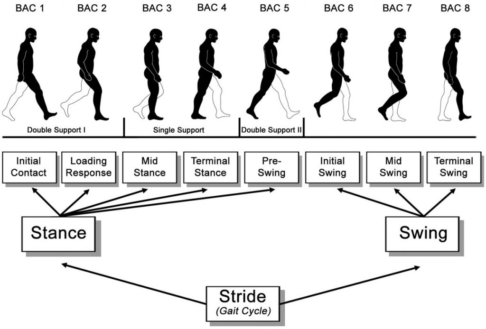

# Four-Phase Gait Annotation Protocol

Version: 1.0-draft

Status: pilot annotation only; labels are not frozen

Intended use: image-observable gait-phase research, not clinical diagnosis



The figure is retained from the historical project as an orientation aid. Its original publication source and reuse permission must be confirmed before it appears in a submitted paper.

## Operational labels

| Label | Start boundary | End boundary | Primary visual cues |
|---|---|---|---|
| `initial_contact_loading` | The observed foot first contacts the ground | The body begins stable single-limb progression | Leading heel/foot contact, weight transfer, early double support |
| `mid_stance` | Stable progression over the supporting foot | Supporting heel begins sustained rise or the body passes clearly ahead of the foot | Trunk advances over planted foot, contralateral limb passes the stance limb |
| `terminal_stance_preswing` | Sustained heel rise/late support begins | Toe-off of the observed foot | Forefoot support, trailing limb, push-off, late double support |
| `swing` | Toe-off | Next initial contact of the same foot | Foot clear of ground, limb advances, knee flexes then extends |

These are operational visual labels. Without synchronized force plates or motion capture, they must not be described as instrument-verified clinical phases.

## Annotation unit

Annotate complete gait cycles within one uninterrupted subject sequence. For each cycle, record five ordered boundary frames:

1. Initial contact
2. Mid-stance start
3. Terminal-stance start
4. Swing start at toe-off
5. Next initial contact

The software assigns all frames between adjacent boundaries to one of the four labels. Do not annotate isolated frames without their sequence context.

## Pilot and calibration

1. Select complete CASIA C sequences spanning all conditions (`fn`, `fs`, `fq`, and `fb`). CASIA A is excluded until complete source sequences are reacquired.
2. Two annotators independently label the same pilot cycles after reading this guide.
3. Compare weighted Cohen's kappa, raw frame agreement, and mean boundary error.
4. Review disagreements without model predictions being visible.
5. Revise ambiguous visual rules and repeat the pilot until weighted kappa is at least 0.80.
6. Freeze the manual version before full annotation. Later rule changes require a new annotation version and re-review of affected cycles.

## Confidence and exclusions

- `high`: all five boundaries are visible and unambiguous.
- `medium`: one boundary is partially obscured but can be located within approximately two frames.
- `low`: one or more boundaries depend heavily on inference.
- Exclude rather than guess when the same foot cannot be tracked, the sequence is truncated, the silhouette is corrupted, or a boundary is not defensible.

Low-confidence cycles remain available for sensitivity analysis but are excluded from the primary experiment unless an expert adjudicates them as usable.

## Independent annotation and adjudication

- Annotators work independently and are blinded to model output and each other's boundaries.
- The gait-domain expert reviews disagreements and low-confidence cycles, not just aggregate scores.
- The adjudicated record retains both original annotations, the final boundaries, confidence, reason, expert ID, and date.
- Never replace an original annotation row; add a versioned adjudication record.

## Boundary template

Use [`annotations/templates/boundaries.csv`](../annotations/templates/boundaries.csv). Frame numbers refer to the source sequence, not renumbered exports. `cycle_id` is unique within a sequence.

Run the agreement gate with:

```powershell
gait-phase annotation-report annotations/working/pilot_boundaries.csv --fps 25
```

Use the actual acquisition frame rate for each dataset when converting boundary error to milliseconds.
